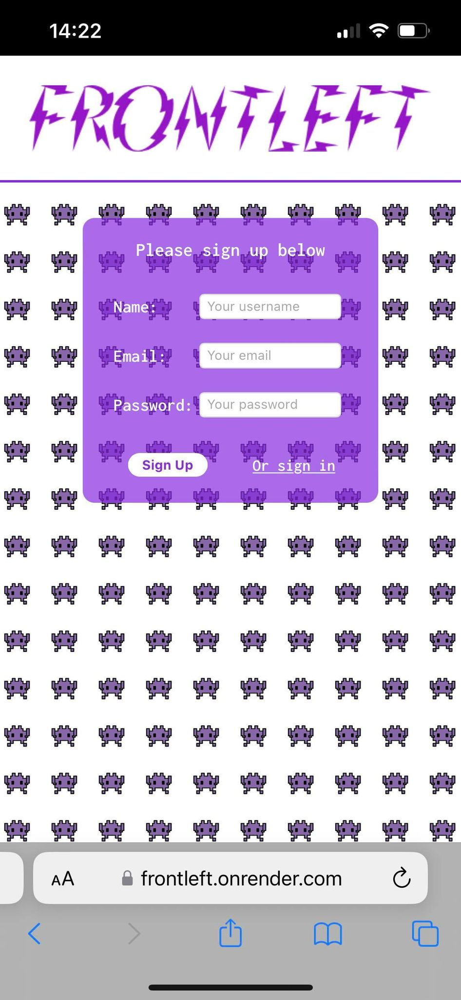

# frontleft

## Intro

With sometimes endless music festival lineups it can be a bit daunting choosing what stages to be at and when, knowing that you may be missing some of your favourite acts or running back and forth and not actually seeing any! This is where frontleft comes in. 

Frontleft will help you plan out your days at a festival and catch every moment of your favourite artists.

Since finishing the Makers Academy coding bootcamp I have setout to learn TypeScript and have built this to put my skills to the test.

[Try it out for yourself!](https://frontleft.onrender.com)

## Technologies

This is a mobile-first MERN stack application written with TypeScript. The styling has been done using CSS. 

The backend was test driven using Jest, as well as testing calls using Postman. The frontend was tested via user interaction, but I intend to add tests as part of the future development of the project.

## Future goals

- add the distances between stages so that a user can make a more informed decision about who to see (it could take the best part of 30 mins to get to one from the other!)
- Create a web scraper too auto-populate the acts from a given festival. Currently the user has to manually type them in

## Screenshots

<table>
  <tr>
    <td>Sign Up</td>
    <td>Save and view acts</td>
    <td>View timeline</td>
  </tr>
  <tr>
    <td></td>
    <td></td>
    <td></td>
  </tr>
 </table>

 ### Larger screen
 
 When viewed on a larger screen, flanking block are introduced to direct user to the centre of the page and reduce white space.

 

### Installation

To download and initialise the project follow the below steps. Note that the JavaScript files are NOT included in the repo and need to be compiled from TypeScript:

```js
$ git clone https://github.com/rkirkbride13/frontleft.git
$ cd frontleft
$ cd app
$ npm install
$ cd ..
$ cd api
$ npm install
$ tsc
```

Create a new .env file in the api folder:

```js
$ cd api
$ touch  .env
```

Copy the below code into the .env file and update:

```js
# .env

JWT_SECRET = "add any random string here"
```

### Using the App

From the main project directory...

Start running the front-end server:

```js
$ cd app
$ npm run start
```

Open a new terminal and start running the back-end server:

```js
$ cd api
$ npm run start
```

Open http://localhost:3000 and use frontleft in your browser.

### Testing the App

From the main project directory...

#### Back-end

```js
$ cd api
$ npm run test
```
