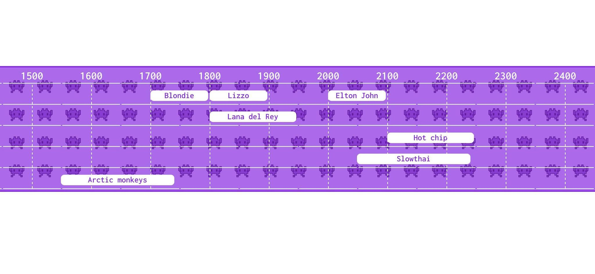

# frontleft

## Intro

With sometimes endless music festival lineups it can be a bit daunting choosing what stages to be at and when, knowing that you may be missing some of your favourite acts or running back and forth and not actually seeing any! This is where frontleft comes in.

Frontleft will help you plan out your days at a festival and catch every moment of your favourite artists.

Since finishing the Makers Academy coding bootcamp I have setout to learn TypeScript and have built this to put my skills to the test.

[Try it out for yourself!](https://frontleft.onrender.com)

## Video

[](https://www.youtube.com/watch?v=Mo3J8VAjf9U&ab_channel=RobbieKirkbride)

## Screenshots

<table>
  <tr>
    <td>Sign Up</td>
    <td>Save and view acts</td>
    <td>View timeline</td>
  </tr>
  <tr>
    <td></td>
    <td></td>
    <td></td>
  </tr>
 </table>

### Larger screen

When viewed on a larger screen, flanking blocks are introduced to direct user to the centre of the page and reduce white space.


## Technologies

This is a mobile-first MERN stack application written with TypeScript. The styling has been done using CSS.

The backend was test driven using Jest, as well as testing calls using Postman. The frontend was tested with Cypress.

### Packages

- [Bcrypt](https://www.npmjs.com/package/bcrypt) has been used for password encryption.
- [JWT](https://www.npmjs.com/package/jsonwebtoken) used for user verification and route protection.
- [Multer](https://www.npmjs.com/package/multer) has been used to allow user to upload an image.
- [Sharp](https://www.npmjs.com/package/sharp) has been used to convert images to a common format.
- [Mongoose](https://www.npmjs.com/package/mongoose) has been used to create schema-based solutions for models.
- [Dotenv](https://www.npmjs.com/package/dotenv) has been used to load environment variables from a .env file.
- [Cors](https://www.npmjs.com/package/cors) has been used to enable cross-origin requests.
- [Sendgrid](https://www.npmjs.com/package/@sendgrid/mail) has been used to send new users a welcome email.

## Future goals

- Grey out dates that don't coincide with Glastonbury
- Change timelines to be from 12pm-6am each day
- On timelines, cut-off long performer names and add button to reveal the full name is it is cut

### Installation

To download and initialise the project follow the below steps. Note that the JavaScript files are NOT included in the repo and need to be compiled from TypeScript:

```js
$ git clone https://github.com/rkirkbride13/frontleft.git
$ cd frontleft
$ cd app
$ npm install
$ cd ..
$ cd api
$ npm install
$ tsc
```

Create a new .env file in the api folder:

```js
$ cd api
$ touch  .env
```

Copy the below code into the .env file and update:

```js
# .env

JWT_SECRET = "add any random string here"
SENDGRID_API_KEY="Your API key"
ADMIN_EMAIL="Your regiestered Sendgrid email"
```

### Using the App

From the main project directory...

Start running the front-end server:

```js
$ cd app
$ npm run start
```

Open a new terminal and start running the back-end server:

```js
$ cd api
$ npm run start
```

Open http://localhost:3000 and use frontleft in your browser.

### Testing the App

From the main project directory...

#### Back-end

```js
$ cd api
$ npm run test
```

### Front-end

```js
$ cd frontend
$ npm run test
```

**Important:** Ensure you are running both front-end and back-end servers before running the tests.
